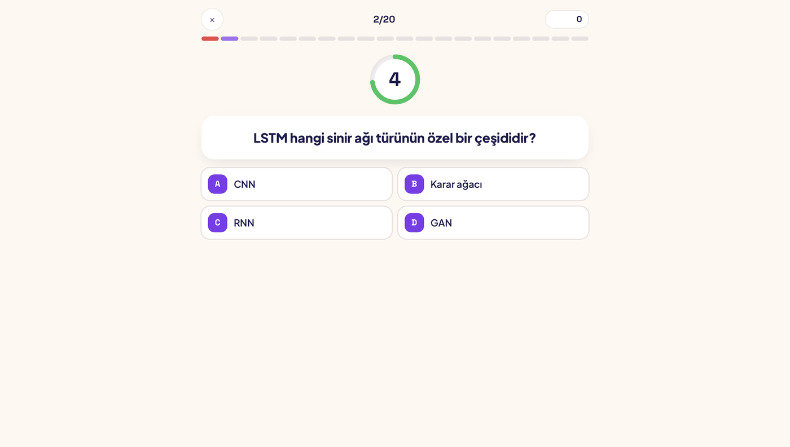
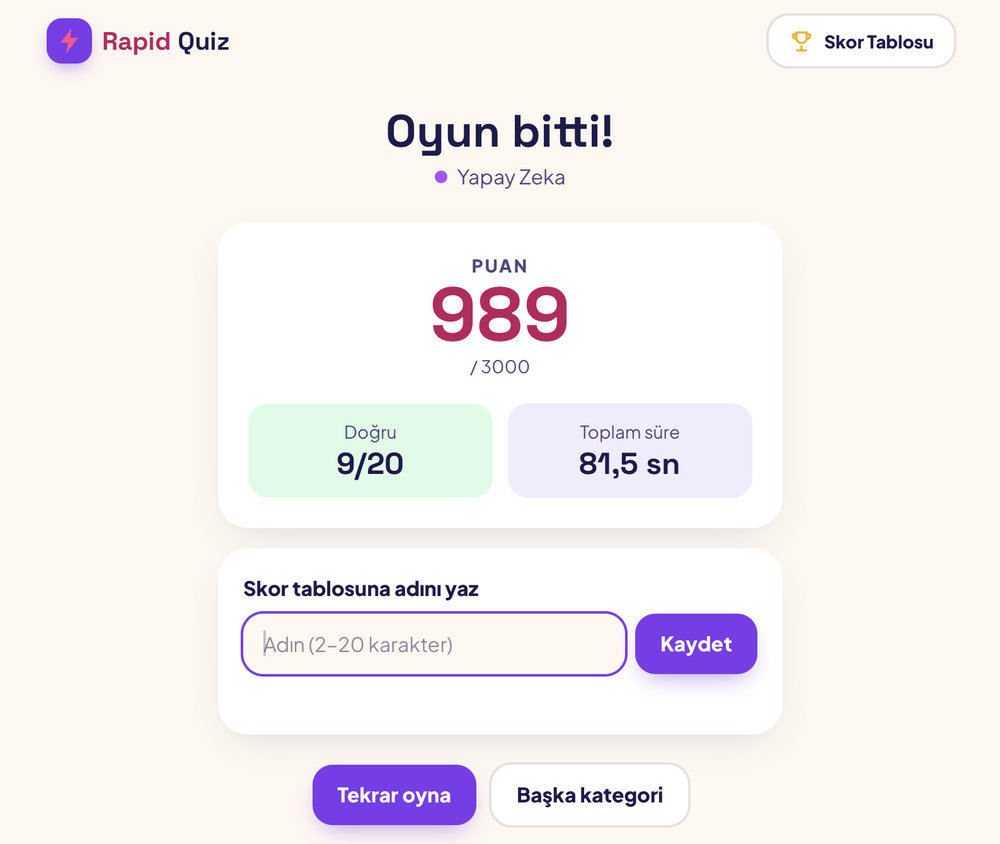
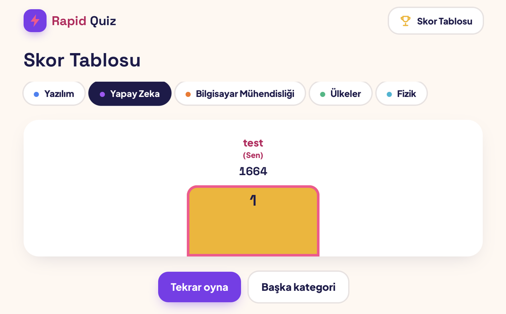

🇬🇧 English | [🇹🇷 Türkçe](README.tr.md)

# Rapid Quiz — Web

The web client for a fast-paced trivia game: **20 questions, 5 seconds each, no sign-up**, and a **Top 10 leaderboard per category**. It is built with Vue 3 and TypeScript.

> **Part of Rapid Quiz**
>
> | Repository | Role |
> | --- | --- |
> | [RapidQuizBackend](https://github.com/busracankit/RapidQuizBackend) | Django REST API: game logic, scoring, leaderboards |
> | [RapidQuizFrontend](https://github.com/busracankit/RapidQuizFrontend) | Web client (Vue 3 + TypeScript, this repo) |
> | [RapidQuizAndroid](https://github.com/busracankit/RapidQuizAndroid) | Android client (Kotlin + Jetpack Compose) |
>
> There is no live deployment. The app was deployed once to DigitalOcean App Platform for testing and then shut down. It runs locally against the backend (see [Getting started](#getting-started)).

## Screenshots



| Result | Leaderboard |
| --- | --- |
|  |  |

## Features

- **Five views:**
  - **Home**: category cards.
  - **Ready**: the rules and a 3-2-1 countdown.
  - **Question**: a circular 5-second timer, a 20-segment progress bar, A–D answers, correct/wrong feedback and points earned.
  - **Result**: an animated score, the correct count, the total time, and saving the score with a name.
  - **Leaderboard**: category tabs, a top-3 podium, ranks 4–10, the player's own row highlighted, and their rank when they are outside the top 10.
- Keyboard play on desktop: keys `1–4` or `A–D` choose an answer.
- Survives a page reload mid-game: the session is kept in `sessionStorage` and resynced with the server.
- Mobile-first layout, haptic feedback on supported phones, and decorative animations disabled when `prefers-reduced-motion` is on.
- Turkish UI. All texts live in one file (`src/i18n/tr.ts`).

## Tech stack

| Area | Tools |
| --- | --- |
| Framework | Vue 3.5 (`<script setup>`, Composition API), TypeScript 5.9 |
| Build | Vite 8, Node 24 |
| State & routing | Pinia 4, Vue Router 5 (history mode) |
| Styling | Tailwind CSS 4, Space Grotesk and Plus Jakarta Sans (via Fontsource) |
| API | Axios, with types generated from the backend's OpenAPI schema (`openapi-typescript`) |
| Quality | ESLint 10, `vue-tsc`, Vitest 5 + Vue Test Utils, Playwright 1.63 |
| CI | GitHub Actions: lint, type-check, unit tests, build and end-to-end tests |

## Architecture and key design decisions

- **A thin client by design.** The server decides points, timing and whether an answer is correct. The client only displays the results, and the correct answer arrives only after the player answers.
- **Typed API contract.** `src/api/schema.d.ts` is generated from the backend's OpenAPI schema (`npm run gen:api`), so a change in the API shows up as a TypeScript error rather than a runtime bug.
- **Timing from the server, measured locally.** Every question comes with `starts_in_ms` and `remaining_ms`. The client computes the start time once, when the response arrives, using `performance.now()`. It never depends on the device clock.
- **No double waiting.** The feedback pause after an answer is the next question's `starts_in_ms`, with no extra delay added. An earlier version waited twice, which cost the player about 0.8 seconds per question; the fix is covered by tests.
- **A clear game state machine.** The Pinia store moves through `idle → ready → playing → answering → feedback → … → finished`. Answers are accepted only in `playing`, which blocks double clicks.
- **No CORS by design.** The API base URL is relative (`/api/v1`). In development, Vite proxies `/api` to the backend. In production, the static site and the API were served from the same origin.
- **Session token in a header.** The `X-Session-Token` is sent as a header; there are no cookies. The token is kept in `sessionStorage`, which is scoped to the tab and cleared when it closes.
- **Tests without a server.** The Playwright tests mock the API with `page.route`, so the full game flow runs in CI on mobile (Pixel 7) and desktop viewports without a backend.

## Getting started

**Prerequisites:** Node 24 and the [backend](https://github.com/busracankit/RapidQuizBackend#getting-started) running on `http://localhost:8000`.

```bash
git clone https://github.com/busracankit/RapidQuizFrontend.git
cd RapidQuizFrontend

npm install
cp .env.example .env    # optional: the defaults already proxy /api to http://localhost:8000
npm run dev             # http://localhost:5173
```

| Variable | Default | Purpose |
| --- | --- | --- |
| `VITE_API_BASE_URL` | empty | API origin baked in at build time. Leave it empty when the API is served from the same origin. |
| `VITE_API_PROXY_TARGET` | `http://localhost:8000` | Where the dev server forwards `/api` requests |

Other scripts:

```bash
npm run build      # type-check + production build into dist/
npm run preview    # serve the production build locally
npm run gen:api    # regenerate API types from http://localhost:8000/api/schema/
```

## Running tests

```bash
npm test                               # unit tests (Vitest): 23 tests
npm run lint && npm run type-check     # ESLint + vue-tsc
npx playwright install chromium        # once
npm run test:e2e                       # end-to-end (Playwright): 5 scenarios × mobile and desktop
```

The unit tests cover the quiz store (start, answers, timeouts, the single feedback wait, double-click protection, resume after reload, expired sessions, saving the score), the countdown composable and the main components. The end-to-end tests cover a full game from home to Top 10, resuming after a reload, keyboard answers on desktop, the leaderboard tabs and empty state, and a missing-session error.

## Project structure

```
src/
├── api/            # Axios client, generated OpenAPI types, API functions
├── stores/quiz.ts  # game state machine and timing (Pinia)
├── views/          # Home, Ready, Question, Result, Leaderboard
├── components/     # category card, answer button, countdown ring, progress bar, podium…
├── composables/    # useCountdown, useCountUp
├── i18n/tr.ts      # UI texts (Turkish)
├── router/         # routes (history mode)
└── assets/styles/  # Tailwind theme tokens
tests/
├── unit/           # Vitest + Vue Test Utils
└── e2e/            # Playwright with a mocked API
docs/screenshots/   # images used in this README
```
